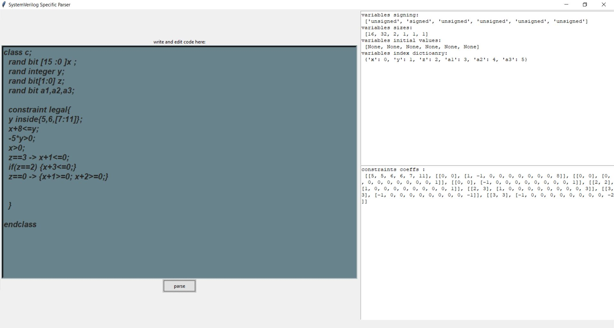

# SystemVerilog-Specific-Parser
This is a parser to SystemVerilog syntax , it's intended to parse data declarations and constraints , then convert them to a specific format which is suitable for our solver tool.

# GUI 

